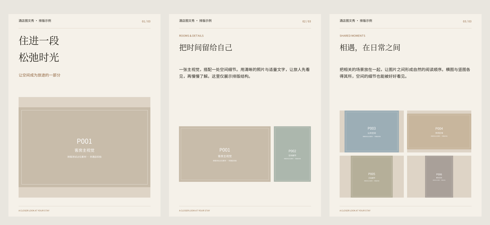

# ComfyUI-HotelShow

酒店 / 民宿图文秀排版节点。将酒店实拍与结构化文案组合成中文图文长图和分页图片。

**当前为 0.1.0 预览版。** 排版引擎已通过本地测试；RunningHub 安装、官方模型调用及端到端流程尚未实测。模板较基础，留白与版式丰富度仍有改进空间。

## 节点

| 类型 | 显示名称 | 功能 |
|---|---|---|
| `HotelShowPrepare` | HotelShow · 多图整理 / ZIP | ZIP 或多图输入、编号、完全重复去重、联系表、策划提示词 |
| `HotelShowRender` | HotelShow · 酒店图文精确排版 | 校验模型 JSON、中文字体绘制、等比图片排版、分页和长图 |

本节点包不调用模型。示例工作流通过另一个现成节点包 [ComfyUI_RH_OpenAPI](https://github.com/HM-RunningHub/ComfyUI_RH_OpenAPI) 调用多模态模型。

## RunningHub

在 RunningHub 的第三方节点安装入口提交本仓库地址。安装完成并重启后，应能搜索到上述两个节点。平台是否允许自定义上传路由和前端扩展，需实际验证。

1. 从 [example_workflows](example_workflows) 下载不带 `.api` 的 JSON。
2. 优先导入 `02_精确排版_多图输入.json`，使用原生 LoadImage 加载照片。
3. 安装/启用官方 RunningHub 模型节点包，填写酒店名称和已确认资料。
4. 按模型节点要求配置凭据，运行后下载分页图片或整张长图。

`01_精确排版_ZIP输入.json` 依赖上传按钮和路由；若不被云端支持，请使用多图连线版本。JSON 导入不会自动安装依赖，也不代表平台已收录本仓库。

## 自有 ComfyUI 服务端

将本仓库克隆到 `ComfyUI/custom_nodes/ComfyUI-HotelShow`。使用 ComfyUI 的 Python 环境执行 `python -m pip install -r requirements.txt`，然后重启。建议 Python 3.10+。Torch 和 aiohttp 使用 ComfyUI 已有版本。

中文字体位于 `fonts/`，含 Noto Sans SC、Noto Serif SC 与 OFL 许可证，无需在运行时联网取字体。

## 工作方式

```text
图片/ZIP → HotelShowPrepare → 联系表 + 提示词 → 多模态模型
                  │                              │
                  └─ 原照片 → HotelShowRender ← JSON
                                   ↓
                         分页 IMAGE + 长图 IMAGE
```

- 一次最多 24 张图片。12 个可选 IMAGE 输入允许不同尺寸；单个插槽也能接 IMAGE batch。
- 不要把 ComfyUI 执行列表（IMAGE list）与 batch 混淆，否则可能逐张运行整条链。
- ZIP 解压后图片总大小上限 100 MiB；相机大图请先制作较小的工作副本。
- 默认 contain 等比保留画面；cover 会中心裁切。没有实现语义焦点裁切。
- 模型仅依据可见画面及酒店确认资料写文案，事实准确性仍需人工复核。
- `manual_plan` 可覆盖模型 JSON。模型输出失败或排版溢出时会明确报错。
- 三套配色、黑体/宋体标题；不支持任意版式自动设计。

## 离线演示

```bash
python -m pip install Pillow numpy
python render_local.py --input examples/测试素材_非酒店实拍.zip --hotel "酒店图文秀 · 排版示例" --plan examples/测试策划.json --output output/demo
python -m unittest discover -s tests -v
```

演示素材是色块占位图，策划 JSON 为人工示例，不是模型端到端执行结果。仓库不包含真实酒店原图或账户凭据。



完整限制、模型凭据要求、参数及故障处理见 [中文指南](GUIDE.zh-CN.md)。

## 许可证

节点代码采用 MIT；字体使用各自附带的 SIL Open Font License。字体来源与许可证见 [fonts](fonts)。
